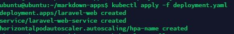
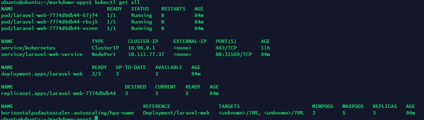
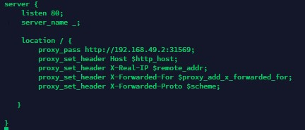
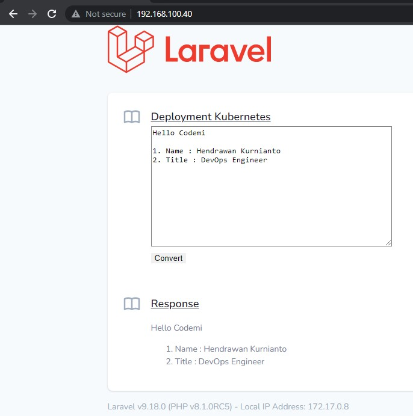

1. Creating a simple application that is converting Markdown to HTML built with the Laravel framework.
2. Create Dockerfile for laravel application. Dockerfile using php8.1-apache image and running on port 80.
3. Created a yaml file for a kubernetes deployment containing the kind of Deployment, Service, HorizontalPodAutoscaler(HPA).
4. Deploy apps to kubernetes.

   
   
5. When finished check pods, services and hpa with the kubectl get all command. The pods run with 3 replica compatible pods in HPA. Autoscaler will run if cpu/memory resource reaches 70%.

   

6. Configure nginx as proxy.

   
   
7. Application successfully accessed.

   
